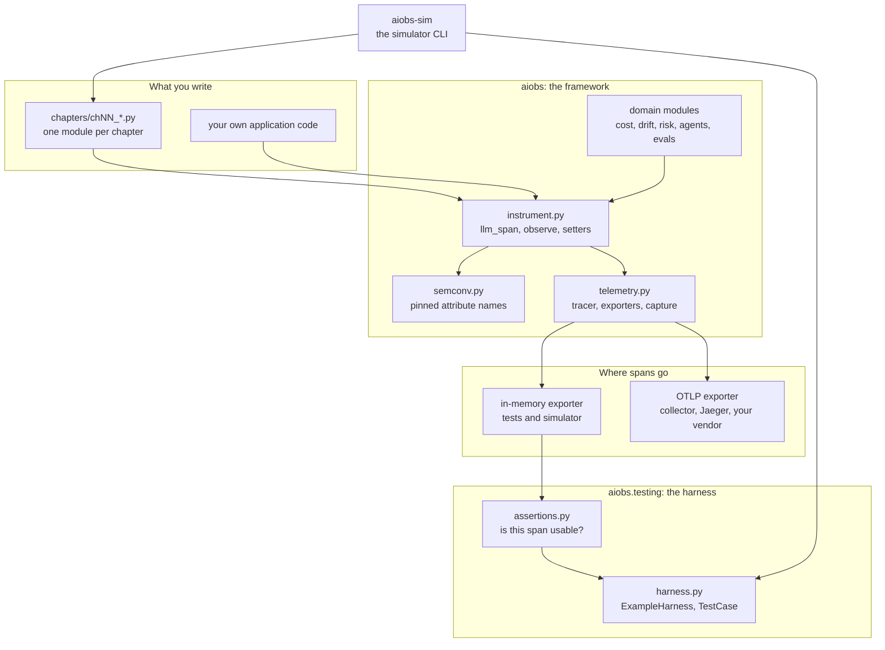
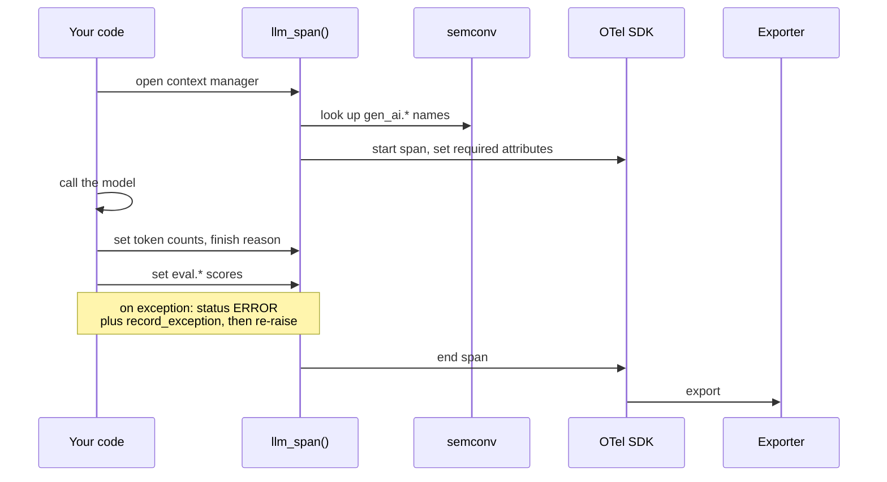
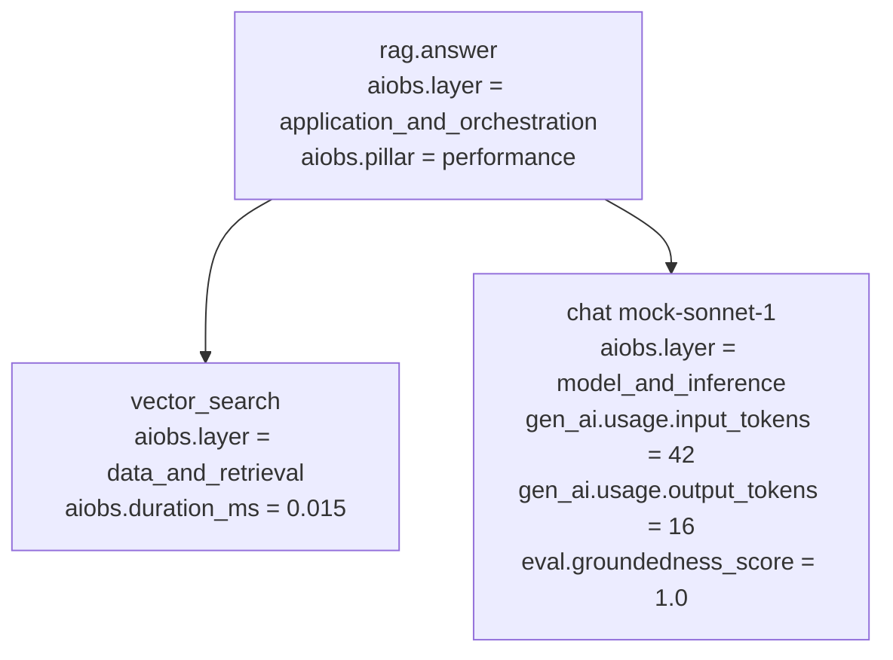
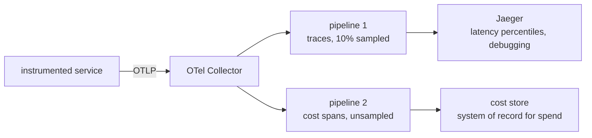
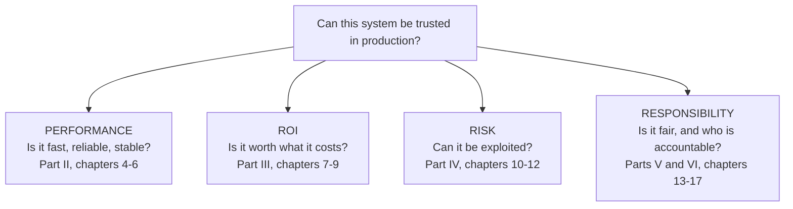
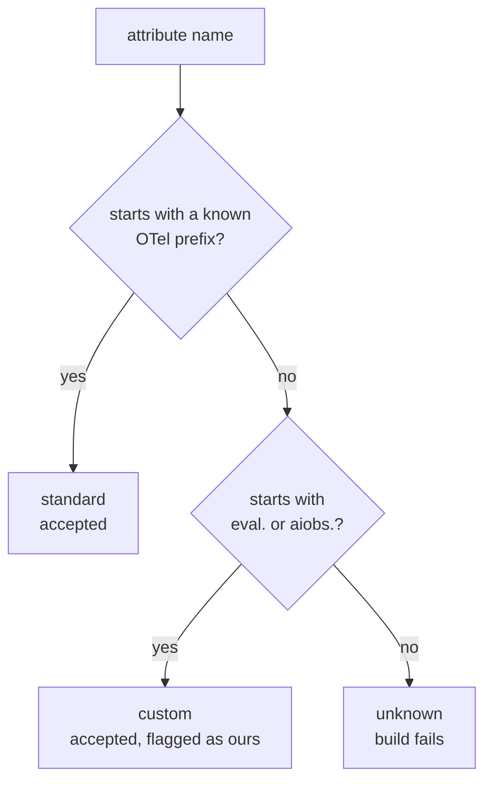
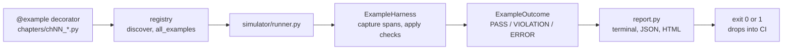

# AI Observability Engineering

Companion repository for **_AI Observability Engineering: Operating Intelligent Systems in Production_** (Pearson Addison-Wesley).

A traditional monitoring stack will tell you that an LLM request returned HTTP 200 in 142 milliseconds. It will not tell you that the answer was fluent, well formed, and wrong. That gap is the subject of the book, and this repository is the runnable form of the argument: a small instrumentation framework, a test harness that checks the instrumentation itself, and a simulator that executes every listing in the manuscript on every commit.

**No API key is required.** Every example runs offline against a seeded mock provider, so results are deterministic, reproducible, and free.

---

## Contents

- [Why this repository exists](#why-this-repository-exists)
- [What is in the box](#what-is-in-the-box)
- [Quick start](#quick-start)
- [Architecture at a glance](#architecture-at-a-glance)
- [Tutorial 1: instrument a single model call](#tutorial-1-instrument-a-single-model-call)
- [Tutorial 2: trace a pipeline, not a call](#tutorial-2-trace-a-pipeline-not-a-call)
- [Tutorial 3: test your instrumentation](#tutorial-3-test-your-instrumentation)
- [Tutorial 4: send spans to a real backend](#tutorial-4-send-spans-to-a-real-backend)
- [Tutorial 5: use aiobs in your own project](#tutorial-5-use-aiobs-in-your-own-project)
- [The conceptual model: pillars, layers, scopes](#the-conceptual-model-pillars-layers-scopes)
- [Attribute namespaces](#attribute-namespaces)
- [The example registry and the simulator](#the-example-registry-and-the-simulator)
- [Failure scenarios](#failure-scenarios)
- [Repository layout](#repository-layout)
- [Chapter to module map](#chapter-to-module-map)
- [A note on the numbers](#a-note-on-the-numbers)

---

## Why this repository exists

Three problems motivated the code here.

**1. Classical APM is blind to the failures that matter.** A model can return a confident, well formed, factually false answer with a clean status code and normal latency. Every dashboard stays green. Chapter 1 makes this argument in prose; `chapters/ch01_foundations.py` makes it in spans, by instrumenting the same request twice and showing what the second version records that the first cannot.

**2. Instrumentation is code, and untested code rots.** Most teams write span attributes once and never check them again. Six months later half the spans are missing token counts and nobody noticed, because nothing was asserting on them. `aiobs.testing` treats the telemetry contract as something you test, with assertions that fail a build when a span is missing the attributes that make it useful.

**3. Book code drifts from reality.** Listings in a printed book stop working. Every listing in this manuscript is a registered example here, and every registered example runs in CI. If a listing breaks, the build fails and names the chapter.

---

## What is in the box

| Component | Package | What it does |
|---|---|---|
| **Framework** | `aiobs` | Instrumentation helpers on top of OpenTelemetry, organized around the book's four pillars and five observable layers |
| **Harness** | `aiobs.testing` | Assertions, fixtures, and two test entry points for checking that instrumentation is correct |
| **Simulator** | `aiobs-sim` | A CLI that runs every book example, reports what each one emitted, and exits nonzero on failure |

---

## Quick start

```bash
git clone https://github.com/brianray/ai-observability-engineering.git
cd ai-observability-engineering/ai-observability-engineering
python -m pip install -e ".[dev]"

aiobs-sim run --all        # run every example in the book
pytest                     # run the full test suite
```

> **Note on the path.** The Python project lives in the `ai-observability-engineering/` subdirectory of the repository, so the `cd` above descends two levels. Every path in this document is relative to that directory.

Requires Python 3.10 or later. Expected output from `aiobs-sim run --all`:

```
Chapter 01  The Observability Imperative for AI Systems   [Part I: Foundations of AI Observability]
  PASS  traditional_vs_llm_span           Listing 1.1     2 spans      63 tok  $ 0.000000    1.4 ms
  PASS  green_dashboard_wrong_answer      -               1 spans      31 tok  $ 0.000000    0.6 ms
...
Pillar coverage (declared / observed on spans)
  performance        16 / 15
  roi                 8 / 9
  risk                4 / 4
  responsibility      5 / 5

33/33 examples passed  |  224 spans (161 LLM)  |  6005 tokens  |  $0.235405 simulated  |  91 ms
```

The test suite is 387 tests: 97 unit tests covering framework internals, and 290 functional tests covering every example and every chapter's claims.

### Verified dependency versions

These are the versions currently validated by the runnable examples and test
suite:

| Package | Version | Notes |
|---|---|---|
| `opentelemetry-api` | `1.44.0` | Exact runtime dependency in `pyproject.toml` |
| `opentelemetry-sdk` | `1.44.0` | Exact runtime dependency in `pyproject.toml` |
| `langchain` | not used | No Chapter 5 example in this repository depends on LangChain today |

---

## Architecture at a glance

The three components stack. The framework emits spans, the harness inspects them, and the simulator drives the whole thing across all 17 chapters.



The important edge is `INST --> SEM`. Attribute name strings appear in exactly one file. When the OpenTelemetry GenAI conventions move, `semconv.py` changes and nothing else does.

### How a single span gets built



---

## Tutorial 1: instrument a single model call

Start with the smallest complete thing: one model call, correctly instrumented, verified.

```python
from aiobs import MockProvider, capture, llm_span, default_suite
from aiobs.instrument import set_eval_attributes, set_llm_attributes
from aiobs.testing import assert_llm_span, assert_semconv_compliant

context = "Refund extensions apply only to active products purchased after March 2025."
question = "Is the discontinued model still eligible?"

with capture() as spans:
    provider = MockProvider()
    reply = provider.chat(question, context=context)

    with llm_span(provider=provider.name, model=provider.model) as span:
        set_llm_attributes(
            span,
            provider=provider.name,
            model=reply.model,
            input_tokens=reply.input_tokens,
            output_tokens=reply.output_tokens,
        )
        scores = default_suite().scores(reply.text, context=context, prompt=question)
        set_eval_attributes(span, scores, evaluator="heuristic-v1")

assert_llm_span(spans[0])          # required gen_ai.* attributes are present
assert_semconv_compliant(spans[0]) # no attribute outside a declared namespace
```

Four pieces are doing work here.

**`capture()`** installs an in-memory exporter and hands back a list that fills in when the block exits. This is what makes spans assertable. Nothing leaves the process.

**`llm_span()`** opens a span that already carries the required `gen_ai.*` attributes, so the common failure of emitting a span with no model name cannot happen by omission. It also handles the error path: an exception inside the block sets `StatusCode.ERROR`, records the exception, and re-raises.

**`set_llm_attributes()`** fills in what you only know after the call returns: token counts, finish reason, response id. Optional arguments left as `None` are simply not written, rather than written as empty strings.

**`set_eval_attributes()`** attaches output-quality scores under `eval.*`. This is the part no classical APM tool has, and it is the reason the span can distinguish a good answer from a confident wrong one.

Run it and inspect what came out:

```python
for key, value in sorted(dict(spans[0].attributes).items()):
    print(f"{key} = {value}")
```

```
aiobs.layer = model_and_inference
eval.evaluator = heuristic-v1
eval.groundedness_score = 1.0
eval.hallucination_score = 0.0
eval.relevance_score = 0.0
gen_ai.operation.name = chat
gen_ai.provider.name = mock
gen_ai.request.model = mock-sonnet-1
gen_ai.usage.input_tokens = 29
gen_ai.usage.output_tokens = 19
```

Because the mock is seeded, those numbers are the same on your machine. Note `aiobs.layer` appearing without you setting it: `llm_span` defaults the layer to `MODEL_AND_INFERENCE`, since a span opened by that helper is a model call by definition.

---

## Tutorial 2: trace a pipeline, not a call

A single span tells you what happened. A tree tells you what caused what, and that difference is what separates a trace from a log line. This is the shape of `chapters/ch04_instrumentation.py`:

```python
from aiobs import Aiobs, Layer, MockProvider, Operation, Pillar, get_tracer, llm_span, observe
from aiobs.evals import default_suite
from aiobs.instrument import set_eval_attributes, set_llm_attributes

@observe(pillar=Pillar.PERFORMANCE, layer=Layer.DATA_AND_RETRIEVAL, name="vector_search")
def search(query: str, k: int = 2) -> list[str]:
    ...

tracer = get_tracer(__name__)
provider = MockProvider()

with tracer.start_as_current_span("rag.answer") as root:
    root.set_attribute(Aiobs.LAYER, Layer.APPLICATION_AND_ORCHESTRATION.value)
    root.set_attribute(Aiobs.PILLAR, Pillar.PERFORMANCE.value)

    documents = search(question)                      # child span, retrieval layer
    context = ". ".join(documents)
    reply = provider.chat(question, context=context)

    with llm_span(provider=provider.name, model=provider.model,
                  operation=Operation.CHAT, pillar=Pillar.PERFORMANCE) as span:
        set_llm_attributes(span, provider=provider.name, model=reply.model,
                           input_tokens=reply.input_tokens,
                           output_tokens=reply.output_tokens)
        scores = default_suite().scores(reply.text, context=context, prompt=question)
        set_eval_attributes(span, scores, evaluator="heuristic-v1")
```

The resulting trace, with the layer each span belongs to:



Two things to take from the shape.

**`@observe` is for the non-model steps.** Retrieval, tool calls, and business-outcome recording are not model invocations, so they get a plain span tagged with pillar and layer plus a measured duration. Those tags are what let the simulator report coverage.

**Groundedness is measured against the retrieved context, not against the prompt alone.** That is why the eval call receives `context=context`. When a document changes upstream and the answer quietly stops being supported by it, the groundedness score on this span is where it shows up. `aiobs.testing.scenarios` ships that exact failure as `ungrounded_rag`.

A tool call is a GenAI span that never touched a model:

```python
with tracer.start_as_current_span("execute_tool lookup_order") as span:
    span.set_attribute(GenAI.OPERATION_NAME, Operation.EXECUTE_TOOL)
    span.set_attribute(GenAI.TOOL_NAME, "lookup_order")
    span.set_attribute(GenAI.PROVIDER_NAME, "internal")
    # No model, no tokens, deliberately.
```

Check these with `assert_genai_span`, not `assert_llm_span`. Inventing `model="n/a"` to satisfy a linter makes the trace harder to read, not easier.

---

## Tutorial 3: test your instrumentation

This is the part most teams skip. Two entry points, same underlying contract, so an example that passes one passes the other.

**pytest style:**

```python
from aiobs.testing import ExampleHarness

def test_my_pipeline():
    result = ExampleHarness().run(my_pipeline)
    assert result.ok, result.violations
    assert result.llm_span_count == 1
```

**unittest style:**

```python
from aiobs.testing import ObservabilityTestCase

class TestMyPipeline(ObservabilityTestCase):
    def test_emits_a_valid_llm_span(self):
        with self.capture_spans():
            my_pipeline("hello")
        self.assertLLMSpanCount(1)
        self.assertAllSpansCompliant()
        self.assertSingleTrace()
        self.assertNoPII()
```

`HarnessResult` gives you the aggregates without walking the span list yourself: `ok`, `violations`, `llm_span_count`, `total_tokens`, `total_cost_usd`, `pillars_covered()`, `layers_covered()`.

Add the fixtures to your own `conftest.py`:

```python
pytest_plugins = ["aiobs.testing.fixtures"]
```

That gives you `provider`, `failing_provider`, `harness`, `evals`, `spans`, `knowledge_base`, and an autouse fixture that resets the tracer between tests. Use it. A span leaked from a previous test is the most common cause of a flaky instrumentation suite.

### What each assertion catches

| Assertion | Catches |
|---|---|
| `assert_llm_span` | model-invoking span missing model or token counts |
| `assert_genai_span` | any GenAI span missing operation or provider |
| `assert_semconv_compliant` | attributes outside a declared namespace |
| `assert_no_pii` | emails, SSNs, card numbers in span attributes |
| `assert_same_trace` | broken context propagation across async or thread boundaries |
| `assert_cost_attributed` | cost recorded but left unattributed |
| `assert_evaluated` | missing eval scores, or a hallucination score over threshold |
| `assert_parent_of`, `assert_span_count`, `assert_ok`, `assert_error` | trace structure |

Selectors are exported alongside the assertions when you need to narrow first: `llm_spans`, `genai_spans`, `root_spans`, `spans_named`, `spans_with_attribute`.

---

## Tutorial 4: send spans to a real backend

Everything above ran in memory. Switching to a real backend is an exporter change and nothing else:

```python
from aiobs.telemetry import configure

configure(service_name="my-service", exporter="otlp")
```

Or from the shell, against the bundled Jaeger and collector:

```bash
docker compose up -d
OTEL_EXPORTER_OTLP_ENDPOINT=http://localhost:4318/v1/traces aiobs-sim run --all
open http://localhost:16686
```

Exporters available to `configure()`: `memory` (default, used by tests and the simulator), `console`, `otlp`, and `none`. The OTLP exporter is an optional extra, imported lazily, so the book's examples run with no network stack installed. Install it with `pip install -e ".[otlp]"`.

The collector config in `config/otel-collector.yaml` deliberately runs two pipelines:



That is Chapter 2's argument expressed as a config file. A sampled stream is fine for latency percentiles and useless as a system of record for spend, because 10% of the invoice is not the invoice.

---

## Tutorial 5: use aiobs in your own project

Nothing in the framework depends on the book's chapters. To adopt it in an existing service:

```bash
pip install -e "path/to/ai-observability-engineering/ai-observability-engineering"
```

Then work through four steps.

**1. Configure once, at startup.**

```python
from aiobs.telemetry import configure
configure(service_name="checkout-assistant", exporter="otlp", deployment_environment="prod")
```

Extra keyword arguments become resource attributes. `configure()` is idempotent, so calling it twice is harmless.

**2. Wrap model calls in `llm_span`, everything else in `@observe`.** Tag each with the pillar it serves and the layer it belongs to. The tags cost nothing and are what make coverage reporting possible later.

**3. Attribute cost at the point of spend.**

```python
from aiobs.cost import CostLedger, price_call
from aiobs.instrument import set_cost_attributes

usd = price_call(model, reply.input_tokens, reply.output_tokens)
set_cost_attributes(span, usd, tenant="acme", use_case="refund_qa")
```

`tenant` and `use_case` default to `"unattributed"` and are always written rather than omitted. Omitting them makes unattributed spend invisible; recording it as unattributed makes it countable, which is what `CostLedger.unattributed_share()` reports. `price_call` raises `UnknownModelError` on a model missing from the price book, rather than silently charging zero.

**4. Add the harness to your test suite** so the instrumentation stays correct as the code changes. This is step four in the list and first in importance.

---

## The conceptual model: pillars, layers, scopes

Three orthogonal structures run through the book and through the code. They are not decoration: every example declares a pillar and a layer, and the simulator uses those declarations to report gaps.

### Four pillars, from Chapter 1

Four questions, none of which the other three answer.



### Five layers, from Chapter 2

OpenTelemetry is strong in the middle three layers and thin at both edges. That asymmetry is the structural argument of Chapter 2, and `Layer.otel_coverage` returns it as a property you can assert on.

| Layer | Enum | OTel coverage out of the box |
|---|---|---|
| Infrastructure | `Layer.INFRASTRUCTURE` | partial |
| Model and inference | `Layer.MODEL_AND_INFERENCE` | strong |
| Data and retrieval | `Layer.DATA_AND_RETRIEVAL` | strong |
| Application and orchestration | `Layer.APPLICATION_AND_ORCHESTRATION` | strong |
| Business and outcomes | `Layer.BUSINESS_AND_OUTCOMES` | **thin** |

The thin layers are where this framework adds the most, and where the `aiobs.*` namespace exists.

### Four scopes

`Scope.SPAN`, `Scope.TRACE`, `Scope.SESSION`, `Scope.EXPERIMENT`. A hallucination rate means something different at each one. Chapter 3 works through why, and `gen_ai.conversation.id` is what stitches spans into a session.

---

## Attribute namespaces

The single rule this repository enforces everywhere: **every attribute belongs to a namespace, and you know which kind.**

| Namespace | Status | Owner | Examples |
|---|---|---|---|
| `gen_ai.*` | Standardized | OpenTelemetry GenAI semantic conventions | `gen_ai.request.model`, `gen_ai.usage.input_tokens` |
| `http.*`, `db.*`, `service.*` and other OTel prefixes | Standardized | OpenTelemetry | `http.response.status_code` |
| `eval.*` | **Not standardized** | This book | `eval.groundedness_score` |
| `aiobs.*` | **Not standardized** | This book | `aiobs.cost.usd`, `aiobs.pillar` |
| anything else | Rejected | none | `llm.model`, `my_attribute` |

`semconv.classify()` implements exactly this, and the conformance test in `tests/functional` fails the build on `"unknown"`:



The allowed OTel prefixes are listed explicitly rather than accepting anything containing a dot, because "it has a dot in it" is how an accidental attribute gets through.

`llm.*` was never a convention. Early drafts of this book used it; the tests now fail the build on it.

The conventions are pre-1.0 and attribute names are still moving. `SEMCONV_VERSION` in `aiobs/semconv.py` pins the version this repository was built against, currently `1.37.0`. Change it there, nowhere else, and verify against the [OpenTelemetry GenAI semantic conventions](https://opentelemetry.io/docs/specs/semconv/gen-ai/) before relying on any specific attribute string in production.

---

## The example registry and the simulator

Every listing in the manuscript is a decorated function. The decorator records the metadata that makes coverage reporting possible.

```python
@example(
    chapter=4,
    key="rag_pipeline_traced",
    title="A RAG pipeline traced end to end",
    pillar=Pillar.PERFORMANCE,
    layer=Layer.DATA_AND_RETRIEVAL,
    listing="4.3",
)
def rag_pipeline_traced() -> dict:
    ...
```

The lifecycle from decorator to report:



An example fails in one of two ways, and the simulator distinguishes them. `ERROR` means the code raised. `VIOLATION` means the code ran fine but the instrumentation was wrong, which is the more interesting failure and the one a normal test suite would miss.

`expect_error=True` inverts the pass condition, so an example whose entire point is to demonstrate a failure can still be a green test. `demonstrates_failure=True` relaxes the expectation that the system behaved well while still requiring the instrumentation to be correct.

### Simulator commands

```bash
aiobs-sim run --all                              # everything
aiobs-sim run --chapter 6 --verbose              # one chapter, with tracebacks
aiobs-sim run --pillar risk                      # one pillar
aiobs-sim run --example ch01.traditional_vs_llm_span
aiobs-sim run --all --html report.html           # standalone HTML report
aiobs-sim run --all --json-out report.json       # machine readable to a file
aiobs-sim run --all --lenient                    # skip semconv and PII enforcement
aiobs-sim list                                   # every registered example
aiobs-sim scenarios                              # the named failure scenarios
aiobs-sim coverage                               # pillar, layer, and chapter gaps
```

Exit code is `0` when every selected example passes and `1` otherwise, so it drops straight into CI.

### Reading the coverage report

The coverage report prints **declared** against **observed**, and the gap between the two columns is the point:

```
Pillar coverage (declared / observed on spans)
  performance        11 / 10
  roi                 8 / 9
```

Declared means an example said it serves that pillar. Observed means a span actually carried the tag. Declared higher than observed means an example talks about a pillar without instrumenting it. Observed higher than declared means an example instruments more than it claims, usually because a helper it calls is tagged too.

---

## Failure scenarios

`aiobs.testing.scenarios` ships reproducible versions of the failures the book keeps returning to. Each one is a real production pattern reduced to something you can run in a second.

```bash
aiobs-sim scenarios
```

| Key | Failure | Detected by |
|---|---|---|
| `silent_retry_loop` | Uptime 99.99%, error rate 0.0%, $47,000 bill | `agents.detect_step_repetition` |
| `confidently_wrong` | Fluent, well formed, factually false | `evals.HallucinationEvaluator` |
| `ungrounded_rag` | A document update quietly breaks grounding | `evals.GroundednessEvaluator` |
| `no_termination` | MAST FM-1.5, runs to the step ceiling | `agents.detect_missing_termination` |
| `unverified_output` | MAST FM-3.2, nobody checked the result | `agents.detect_missing_verification` |

`MockProvider` can be scripted into any of these directly through `FailureMode`, which is how the test suite exercises detection paths without waiting for a real system to misbehave:

```python
from aiobs.providers import FailureMode, MockProvider

provider = MockProvider(failure_mode=FailureMode.CONFIDENTLY_WRONG)
```

Available modes: `NONE`, `CONFIDENTLY_WRONG`, `UNGROUNDED`, `RETRY_LOOP`, `NO_TERMINATION`, `DRIFT`, `SLOW`, `ERROR`. Only the last one is visible to a traditional APM tool.

---

## Repository layout

```
src/aiobs/                   the framework
  semconv.py                 pinned attribute names; the thin mapping layer
  telemetry.py               tracer setup, exporters, in-memory span capture
  instrument.py              @observe decorator, llm_span(), attribute helpers
  pillars.py                 four pillars, five layers, four scopes
  providers/                 LLMProvider protocol + the offline mock
  evals/                     evaluator interface, heuristics, suite runner
  cost.py                    price book, cost ledger, ROI arithmetic
  drift.py                   PSI and two-sample KS
  risk.py                    OWASP LLM Top 10 detectors
  agents.py                  MAST failure taxonomy, agent run analysis
  testing/                   THE HARNESS: assertions, fixtures, scenarios

chapters/                    chapter examples; Chapter 5 also has a small `ch05/` package
  registry.py                @example decorator + coverage reporting
  ch01_foundations.py        ... through ch17_accountability.py
  ch05/                      worker-pool and cross-service tracing examples

simulator/                   the simulation app
  runner.py                  executes examples through the harness
  report.py                  terminal, JSON, and standalone HTML output
  app.py                     the aiobs-sim CLI

tests/
  unit/                      framework internals, 96 tests
  functional/                every example, every chapter's claims, 251 tests

config/otel-collector.yaml   two-pipeline collector config (sampled + unsampled cost)
docker-compose.yml           optional local Jaeger + collector
```

---

## Chapter to module map

Each chapter cites the module that implements its listings.

| Chapter | Module | Key APIs |
|---|---|---|
| 1 | `chapters/ch01_foundations.py` | `llm_span`, `set_llm_attributes`, `set_eval_attributes` |
| 2 | `chapters/ch02_anatomy.py` | `Layer`, `observe`, `CostLedger` |
| 3 | `chapters/ch03_signals.py` | `Scope`, `GenAI.CONVERSATION_ID` |
| 4 | `chapters/ch04_instrumentation.py` | `llm_span`, `Operation.EXECUTE_TOOL` |
| 5 | `chapters/ch05_performance.py`, `chapters/ch05/` | percentiles, thread-pool context propagation, cross-service tracing |
| 6 | `chapters/ch06_drift.py` | `drift.population_stability_index`, `drift.kolmogorov_smirnov` |
| 7 | `chapters/ch07_cost_accounting.py` | `CostLedger`, `price_call`, `UnknownModelError` |
| 8 | `chapters/ch08_cost_engineering.py` | routing, cache accounting |
| 9 | `chapters/ch09_roi.py` | `roi`, `cost_per_outcome` |
| 10 | `chapters/ch10_llm_security.py` | `risk.scan`, `risk.detect_system_prompt_leak`, `OwaspLLM` |
| 11 | `chapters/ch11_compliance.py` | NIST AI RMF / EU AI Act / ISO 42001 crosswalk |
| 12 | `chapters/ch12_audit.py` | hash-chained audit records |
| 13 | `chapters/ch13_fairness.py` | cohort quality parity |
| 14 | `chapters/ch14_human_oversight.py` | `Aiobs.HUMAN_REVIEW_OUTCOME` |
| 15 | `chapters/ch15_agent_tracing.py` | `AgentRun`, handoff depth |
| 16 | `chapters/ch16_agent_cost.py` | `agents.classify`, `agents.failure_vector` |
| 17 | `chapters/ch17_accountability.py` | delegation chain attributes |

Cite it in the manuscript like this:

> The complete, runnable version of this listing is in the companion repository at `chapters/ch04_instrumentation.py`. Every listing in this book has a counterpart there, pinned to the library and specification versions current at the time of writing.

---

## A note on the numbers

Every figure the simulator prints is **simulated**, produced by a seeded offline mock. The token counts, latencies, and dollar amounts are internally consistent and reproducible; they are not measurements of any real system, and the price book in `aiobs/cost.py` is illustrative. Refresh it before quoting a cost.

The heuristic evaluators in `aiobs/evals/heuristics.py` exist so the examples run deterministically without a judge model. **Do not ship them as production quality gates.** Swap the implementation, keep the interface.

Framework citations in `chapters/ch11_compliance.py` are illustrative. Verify current article and control numbers against the source text before relying on them.

---

## Documentation

- **[`docs/INSTRUCTIONS.md`](docs/INSTRUCTIONS.md)** setup, first run, troubleshooting, using the framework in your own project
- **[`docs/TESTING.md`](docs/TESTING.md)** the harness in depth, what each assertion catches, how to test instrumentation you already have
- **[`docs/AUTHORING.md`](docs/AUTHORING.md)** adding a chapter example, the contract it has to meet
- **[`CONTRIBUTING.md`](CONTRIBUTING.md)** pull request expectations

---

## License

MIT. See [`LICENSE`](LICENSE).
